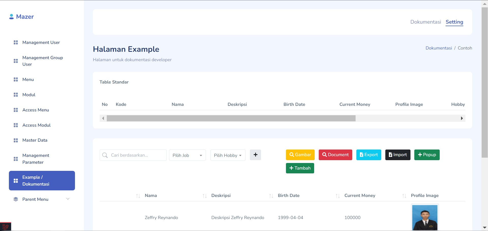
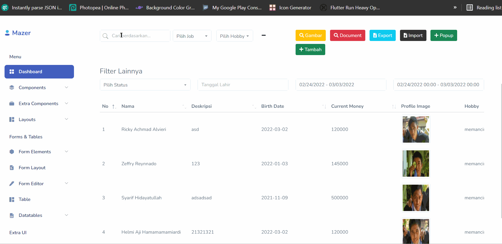
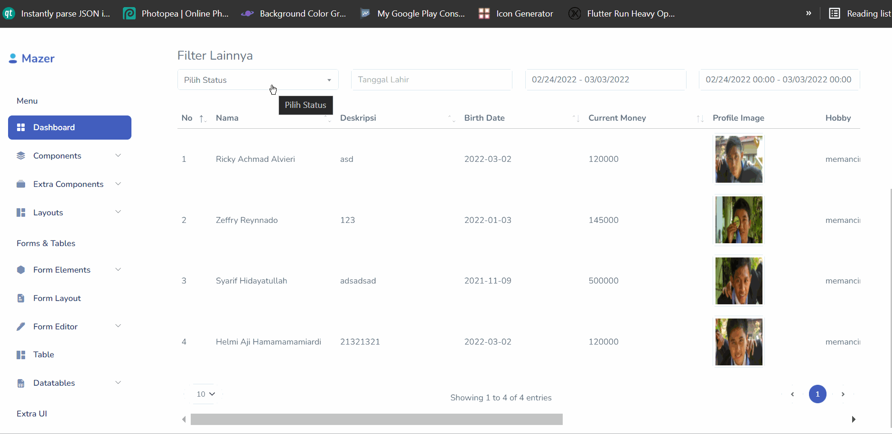
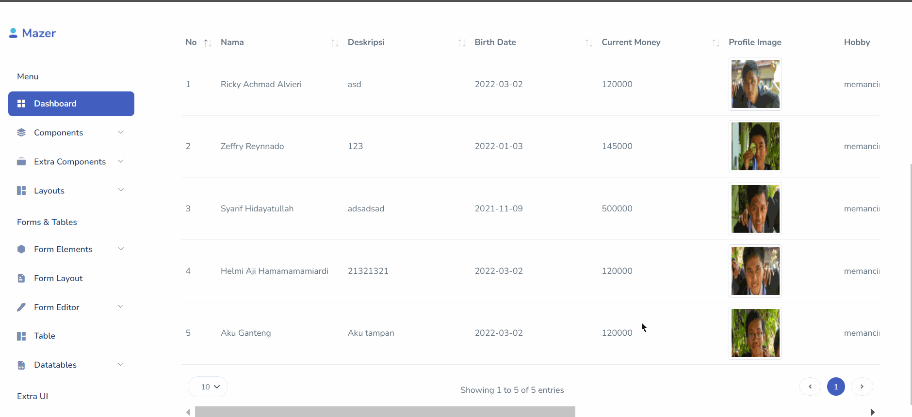
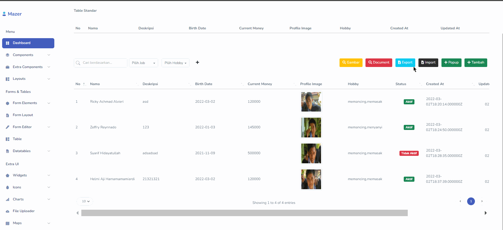
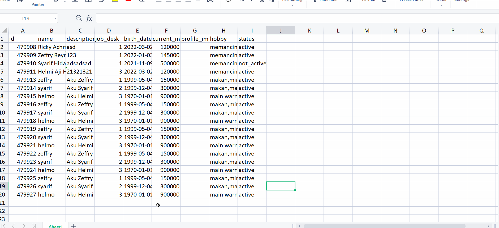
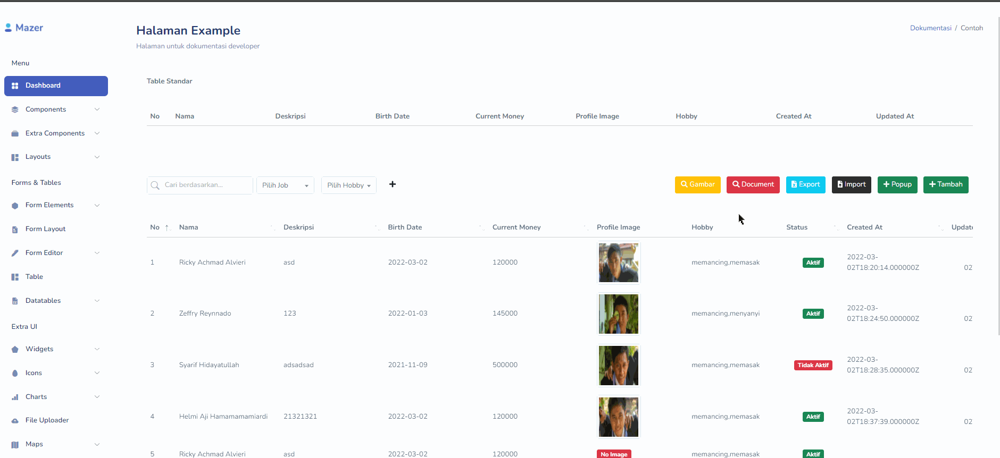
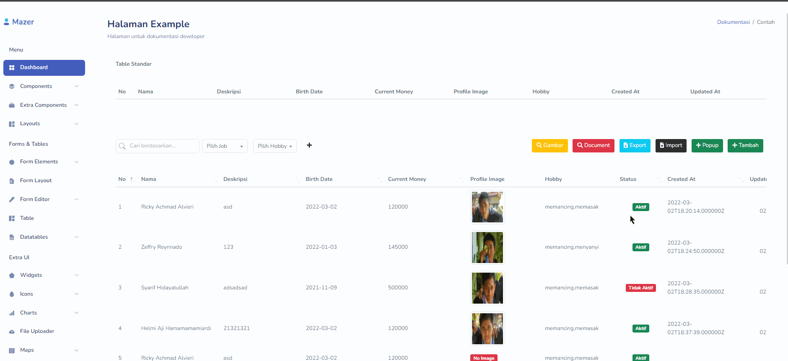

  

# Starter Laravel Project

Dibuatnya project ini karena saya membutuhkan starter project yang didalamnya sudah terdapat fungsi dan template.

## Installasi

Proses instalasinya +- sama seperti clone project laravel pada umumnya, yaitu :

1. `git clone https://github.com/zgramming/laravel-starter-project.git`
2. `cp .env.example .env` silahkan setup database sesuai keinginan
3. `php artisan key:generate`
4. `php artisan migrate:fresh --seed`
5. `composer install`
6. `php artisan serve`
7. Buka browser dengan url `http://127.0.0.1:8000`

## Fitur

### 1. <a href="https://yajrabox.com/docs/laravel-datatables/master/installation" target="_blank">Laravel Yajra Datatable</a>
Beberapa fitur yang sudah ada untuk datatable yaitu :

- [x] Search + Debounce

- [x] Filter by Combo box

- [x] Sorting Asc / Desc
- [x] Custom column (show image, show badge, show button action)

### 2. CRUD Operation
Pada project ini sudah disediakan contoh form dan fungsi-fungsi yang biasanya sering digunakan, diantaranya : 

#### a. Form Create & Update

Fitur yang ada dalam form ini yaitu : 
* Validasi pada sisi client menggunakan <a href="https://jqueryvalidation.org/" target="_blank">Jquery Validation</a>
* Validasi pada sisi server
* Preview gambar sebelum upload file

#### b. Delete data + image if exists
Menghapus data pada database dan memeriksa apakah data terkait mempunyai file/image, jika ada image yang terkait hapus juga image/filenya

#### c. Export Data (<a href="https://github.com/box/spout" target="_blank">Spout library</a>)
Export data dengan menentukan tipe file yang diinginkan, untuk saat ini mensupport XLSX & CSV.

#### d. Import Data (<a href="https://github.com/box/spout" target="_blank">Spout library</a>)
Import data untuk saat ini baru mensupport XLSX, dengan menentukan tiap field yang ada di XLSX dan codingan kamu.

#### e. Preview Document
Menampilkan isi dokumen dalam modal.
Untuk menampilkan isi dari PDF menggunakan plugin <a href="https://mozilla.github.io/pdf.js/" target="_blank">PDFJS</a>

#### f. Preview Image
Menampilkan gambar di dalam modal, berguna ketika ingin melihat gambar dalam ukuran yang lebih besar.

### Credit
Terimakasih kepada <a href="https://github.com/zuramai" target="_blank">zuramai</a>  yang telah membuat template <a href="https://github.com/zuramai/mazer" target="_blank">Mazer</a> yang dimana project ini menggunakan template tersebut didalamnya.

# Issues

Please file any issues, bugs or feature request as an issue on <a href="https://github.com/zgramming/laravel-starter-project/issues"><b> Github </b></a>

# Contributing

Pull requests are welcome. For major changes, please open an issue first to discuss what you would like to change.

 

<table border="0" cellspacing="0" cellpadding="0">
    <thead>
        <tr>
            <th>LinkedIn</th>
            <th>Facebook</th>
            <th>Instagram</th>
            <th>Website</th>
        </tr>
    </thead>
    <tbody>
        <tr>
            <td></td>
            <td></td>
            <td></td>
            <td></td>
        </tr>
    </tbody>

</table>
